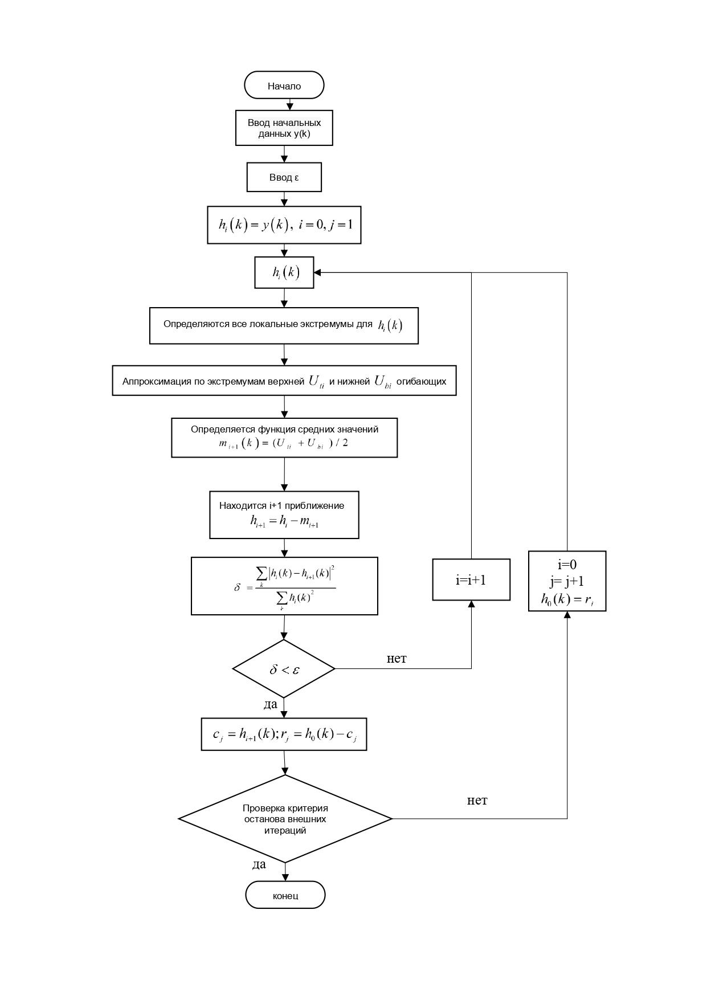
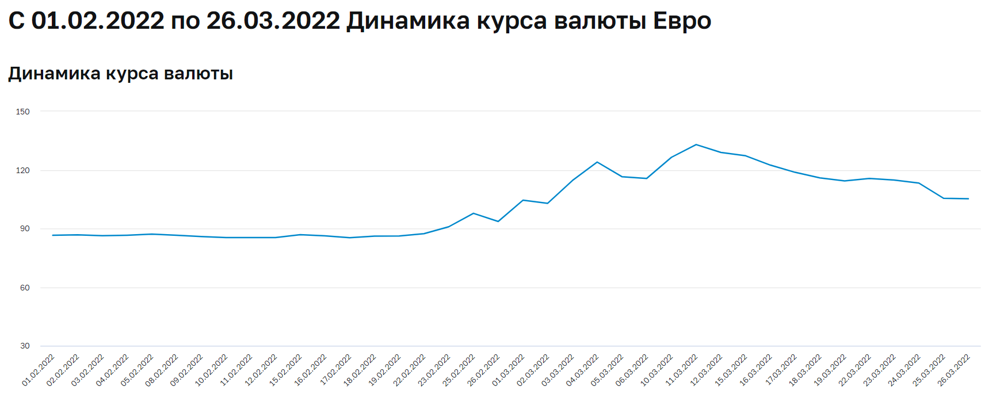
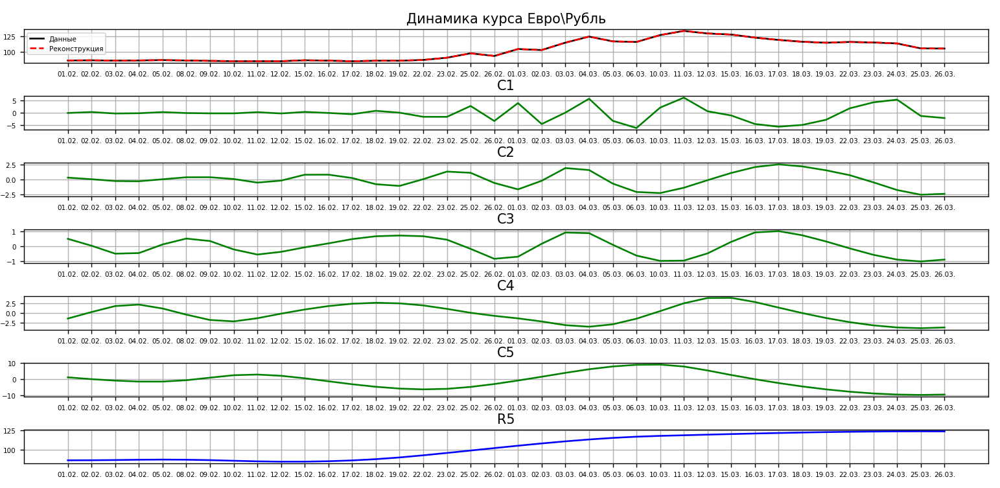

# **EMD - МЕТОД ЭМПИРИЧЕСКОЙ МОДОВОЙ ДЕКОМПОЗИЦИИ**

 ## Empirical Mode Decomposition - метод разложения сигналов на функции, которые получили название «эмпирических мод».

## **Введение**

Ключевое предположение. 
1. *Временной ряд* – совокупность (сумма) колебательных процессов
2. Каждый колебательный процесс может быть представлен функцией внутренней моды (intrinsic mode function - IMF), определяемой т.о.:
    + Число экстремумов и число нулевых пересечений функции должны быть равными или отличаться самое большее на 1.
    + В любой точке функции IMF среднее значение огибающих, определенных
локальными максимумами и локальными минимумами=0.

## **Блок-схема EMD** 

 

  

 

## **Данные** 
Для реализации были взяты данные динамики курса евро с 01.02.2022 по 26.03.2022.
>Источник: Центральный банк Российской Федерации 
URL: https://clck.ru/etTTG

 

  

## **Результаты работы программы** 

 

  

>На изображении представлены исходные данные, реконструированные данные,
а также пять высокочастотных функций и одна низкочастотная 

 *Предположительно:* 

* С1 – политические события
* С2 – случайная составляющая
* С3 – случайная составляющая 
* С4 – цикличность
* С5 – сезонность 
* R5 – тренд
